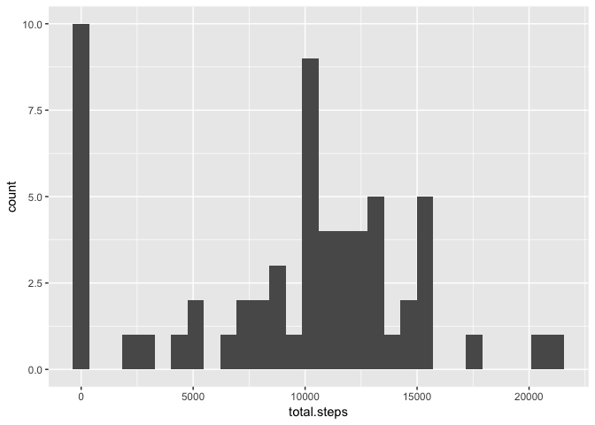
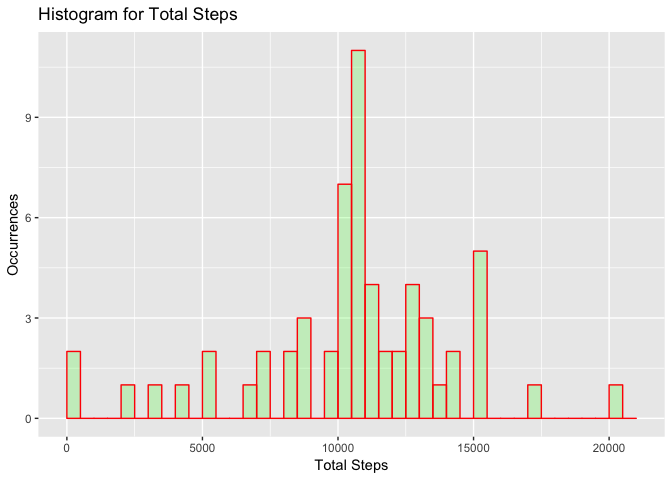

# Reproducible Research: Peer Assessment 1

## Loading basic dependencies

```r
if (!require("ggplot2")) install.packages("ggplot2")
```

```
## Loading required package: ggplot2
```

```r
if (!require("dplyr")) install.packages("dplyr")
```

```
## Loading required package: dplyr
```

```
## Warning: package 'dplyr' was built under R version 3.4.2
```

```
## 
## Attaching package: 'dplyr'
```

```
## The following objects are masked from 'package:stats':
## 
##     filter, lag
```

```
## The following objects are masked from 'package:base':
## 
##     intersect, setdiff, setequal, union
```

```r
if (!require("gridExtra")) install.packages("gridExtra")
```

```
## Loading required package: gridExtra
```

```
## 
## Attaching package: 'gridExtra'
```

```
## The following object is masked from 'package:dplyr':
## 
##     combine
```

```r
library("dplyr")
library("ggplot2")
library("gridExtra")
```

## Loading and preprocessing the data

```r
unzip(zipfile = "activity.zip")
activity <- read.csv(file = "activity.csv", colClasses = c("numeric", "Date", "integer"))
```

## What is mean total number of steps taken per day?

```r
daily.summary <- activity %>% group_by(date) %>% 
                            summarise(total.steps = sum(steps, na.rm = T))
ggplot(data=daily.summary, aes(total.steps)) + geom_histogram() 
```

```
## `stat_bin()` using `bins = 30`. Pick better value with `binwidth`.
```

<!-- -->

```r
daily.summary.avg <- as.integer(round(mean(daily.summary$total.steps)))
daily.summary.median <- as.integer(median(daily.summary$total.steps))
```

### The average number of steps taken daily is 9354 and the median is 10395.

## What is the average daily activity pattern?

```r
# create a new data frame with a average number of steps
# the data frame info is sorted desc by that column in order to the highest interval
interval.summary <- activity %>% group_by(interval) %>% 
                              summarise(avg.steps = mean(steps, na.rm = T)) %>% 
                              arrange(desc(avg.steps)) 

ggplot(data = interval.summary, aes(x=interval, y=avg.steps)) + 
  geom_line() + ggtitle("Average steps in 5 min interval") + 
  xlab("Interval") + ylab("Average Steps")
```

<!-- -->

### The interval in the day 835.

## Imputing missing values

1. Calculate and report the total number of missing values in the dataset (i.e. the total number of rows with 𝙽𝙰s)

### The total number of missing values in the dataset is 2304. 

2. Devise a strategy for filling in all of the missing values in the dataset. The strategy does not need to be sophisticated. For example, you could use the mean/median for that day, or the mean for that 5-minute interval, etc.

3. Create a new dataset that is equal to the original dataset but with the missing data filled in.

### Using the mean to replace the missing steps by the average number of steps per interval: 

```r
# Creating a function to return the the avg steps by interval if the steps are NA
CalculateAvgStepsPerInterval <- function(steps,interv) {
     if(is.na(steps)) {
         filtered.activity <- activity[activity$interval == interv,]
         as.integer(round(mean(filtered.activity$steps, na.rm = T)))
     } else {
       steps
    }
}

# new activity
clean.activity <- activity
clean.activity$steps <- mapply(CalculateAvgStepsPerInterval, 
                               activity$steps, activity$interval)
```

4. Make a histogram of the total number of steps taken each day and Calculate and 
report the mean and median total number of steps taken per day. 


```r
clean.daily.summary <- clean.activity %>% group_by(date) %>% 
                            summarise(total.steps = sum(steps, na.rm = T))
ggplot(data = daily.summary, aes(total.steps)) + geom_histogram() 
```

```
## `stat_bin()` using `bins = 30`. Pick better value with `binwidth`.
```

<!-- -->

```r
clean.daily.summary.avg <- as.integer(round(mean(clean.daily.summary$total.steps)))
clean.daily.summary.median <- as.integer(median(clean.daily.summary$total.steps))
```


### The average number of steps taken daily is 10766 and the median is 10762.

4. Do these values differ from the estimates from the first part of the assignment? What is the impact of imputing missing data on the estimates of the total daily number of steps?

### Yes. It differs in 1412 for the mean and 367 for the median.

## Are there differences in activity patterns between weekdays and weekends?


```r
clean.activity$weekday <- as.factor(ifelse(weekdays(clean.activity$date) %in% 
                                             c("Saturday", "Sunday"), 
                                           "weekend", 
                                           "weekday")
                                    )
interval.summary.weekday <- clean.activity %>% filter(weekday == "weekday") %>% 
                              group_by(interval) %>% 
                              summarise(avg.steps = mean(steps, na.rm = T)) %>% 
                              arrange(desc(avg.steps)) 
interval.summary.weekend <- clean.activity %>% filter(weekday == "weekend") %>% 
                              group_by(interval) %>% 
                              summarise(avg.steps = mean(steps, na.rm = T)) %>% 
                              arrange(desc(avg.steps)) 

plot.weekday <- ggplot(data = interval.summary.weekday, aes(x=interval, y=avg.steps)) + 
  geom_line() + ggtitle("Average steps in 5 min interval (Weekday)") + 
  xlab("Interval") + ylab("Average Steps")

plot.weekend <- ggplot(data = interval.summary.weekend, aes(x=interval, y=avg.steps)) + 
  geom_line() + ggtitle("Average steps in 5 min interval (Weekend)") + 
  xlab("Interval") + ylab("Average Steps")

grid.arrange(plot.weekday, plot.weekend, nrow = 2)
```

<!-- -->
