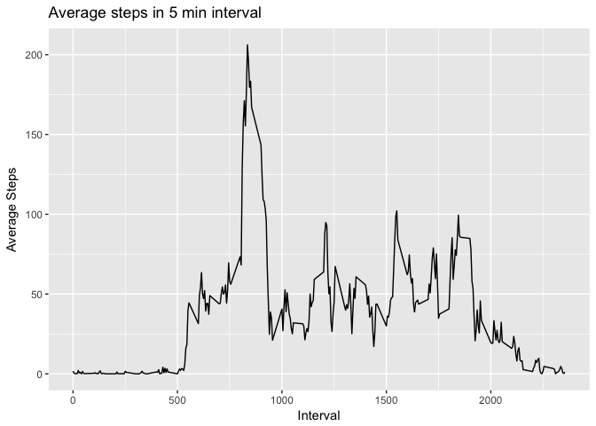

# Reproducible Research: Peer Assessment 1

## Loading basic dependencies

```r
if (!require("ggplot2")) install.packages("ggplot2")
```

```
## Loading required package: ggplot2
```

```r
if (!require("dplyr")) install.packages("dplyr")
```

```
## Loading required package: dplyr
```

```
## Warning: package 'dplyr' was built under R version 3.4.2
```

```
## 
## Attaching package: 'dplyr'
```

```
## The following objects are masked from 'package:stats':
## 
##     filter, lag
```

```
## The following objects are masked from 'package:base':
## 
##     intersect, setdiff, setequal, union
```

```r
library("dplyr")
library("ggplot2")
```

## Loading and preprocessing the data

```r
unzip(zipfile = "activity.zip")
activity <- read.csv(file = "activity.csv")
```

## What is mean total number of steps taken per day?

```r
daily.summary <- activity %>% group_by(date) %>% 
                            summarise(total.steps = sum(steps,na.rm = T))
ggplot(data=daily.summary, aes(total.steps)) + geom_histogram() 
```

```
## `stat_bin()` using `bins = 30`. Pick better value with `binwidth`.
```

<!-- -->

The average number of steps taken daily is 9354.

## What is the average daily activity pattern?

```r
interval.summary <- activity %>% group_by(interval) %>% 
                              summarise(avg.steps = mean(steps, na.rm = T)) %>% 
                              arrange(desc(avg.steps))

ggplot(data= interval.summary, aes(interval, avg.steps)) + geom_line()
```

<!-- -->

The interval in the day 835.

## Imputing missing values


## Are there differences in activity patterns between weekdays and weekends?
